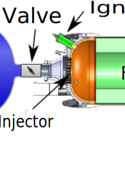

# Planejamento projeto Foguete de Fronteira

[HOPE NF](https://www.youtube.com/watch?v=tsmPCi7NKrg)

**Nome:** Boto Cor de rosa (sugestão de nome, por Lucas)

## Objetivo geral

Desenvolver um foguete de Fronteira para a equipe, como objetivo de aprendizado, desenvolvimento e validação de novas tecnologias a serem implementadas no foguete estavel.

Estudar implementações e novas tecnologias através de pesquisas, visando alcançar modelo de estado da arte.

  Observação: A priori o objetivo irá mudar a partir de novas iterações, mas usando Polo como iteração 0 irá evitar algumas dores de cabeça.

* Aprender a projetar e construir foguetes.
* **Apogeu:** 3km
* **Impulso total:** 12kNs

Cada componente contara com etapas de prototipagem e desenvolvimento em escala menores.

### Objetivos específicos

#### Documentação

* Criar repositorio do github como documentação do projeto e para facilitar a colaboração, usando markdown e seguindo como modelo padrões de documentação de softwares livres, levando em conta que os conhecimentos serão passado para futuros membros da equipe e visando replicabilidade e melhorias futuras de projeto.

* Usando o github como plataforma principal de documentação, colaboração e organização do projeto, usando o sistema de issues para organização de tarefas e o sistema de pull requests para revisão de código e documentação.

* Ao utilizar um unico repositório para documentação e implementação, quando possivel, facilitará comunicação entre componentes e a documentação será mais precisa.

* Transparencia - Todas discussões a respeito do projeto deverão acontecer no repositório do github, para que todos os membros da equipe tenham acesso e possam contribuir caso deseje.

* Problemas e dificuldades encontradas deverão ser descritas em issues, para que possam ser acompanhadas resolvidas e consultadas. PROBLEMAS PRECISAM SER RASTREADOS DOCUMENTADOS E RESOLVIDOS.

#### Motor

* Propulsão Hibrida

* Empuxo vetorizado

#### Eletrônica

* Multiplos cerebro
<!-- USAR SMD para a placa inteira -->
#### Estrutura

* Carga paga ejetavel

#### Recuperação

* Paraquedas de area variavel

## Ferramentas

Optar por uso de ferramentas Open Source, por serem facil acesso, e ao termos acesso ao codigo fonte tambem mantem aberto possibilidade de melhorias, customizações e pesquisas.

* Github - Documentação e organização do projeto
* Markdown - Documentação
* {CAD Software} - Salvar modelos preferencialmente em formato .stl por ser aberto, compativel com github, e outros softwares de CAD.

***FERRAMENTAS DE ANALISE NÃO SÃO FERRAMENTAS DE PROJETO.***

## Etapas

Cada etapa deverá ser documentada em um relatório técnico. É estritamente recomendado que as etapas entre os componentes sejam feitas em paralelo, e que mudanças que afetem outros componentes sejam comunicadas o mais rápido possível utilizando das ferramentas principais para isso, Github e Markdown.

Usando Technology Readiness Level iremos acompanhar o desenvolvimento do projeto.

As etapas 1 ao 6 poderão ser desenvolvidas em modelo Iniciação Científica, com acompanhamento de um professor orientador e de acordo com editais de bolsa, tendo como principais vantagens, participação de professores na orientação do projeto, e maior comprometimento por parte dos membros da equipe.

* Pesquisa e modelagem :

São as iterações de pesquisas, requisito e determinação dos modelos a serem construido.

  1. Basic principles observed and reported (1 mês)
  2. Technology concept and/or application formulated (2 meses)
  3. Analytical and experimental critical function and/or characteristic proof-of-concept (3 meses)

* Design e prototipagem :

Implementar os prototipos de cada componente em escala reduzida.

  4. Component and/or breadboard validation in a laboratory environment (4 meses)
  5. Component and/or breadboard validation in relevant environment (4 meses)
  6. System/subsystem model or prototype demonstration in a relevant environment (ground or space) (4 meses)

* Integração e implementação em escala :

Integração dos componentes, teste em escala real e lançamento.

  7. System prototype demonstration in a space environment (2 meses)
  8. Actual system completed and "flight qualified" through test and demonstration (ground or space) (2 meses)
  9. Actual system "flight proven" through successful mission operations (1 mes)

A partir do level 7 a tecnologia se tornara apta para ser adaptada e implementada no foguete estavel.

## Work breakdown structure
<!-- Utilizando https://en.wikipedia.org/wiki/Work_breakdown_structure decompor os componentes a serem desenvolvidos, e tambem as etapas/atividades/eventos a serem realizadas, como integrações e afins 
TODO: Verificar regra dos 100%
TODO: Revisão acompanhada de mais membros
-->

A missão será reduzida em componentes usando Work breakdown structure.

Critérios para decomposição:

* Cada componente deve ser claramente definido e independente
* Cada componente deve poder ser testado e\ou validado de maneira independe (?)

```mermaid
%%{init: {"flowchart": {"defaultRenderer": "elk"}} }%%
flowchart TD;

  Missão --> Foguete;
    Foguete --> Motor;
      Motor --> injetor[Injetor*];
      Motor --> propelente[Propelente*];
        propelente --> Combustível;
        propelente --> Oxidante;
      Motor --> combustionChamber[Câmara de combustão];
      Motor --> oxidizerTank[Tanque de Oxidante];
      Motor --> Tubeira;
      Motor --> ignitor[Ignitor*];
      Motor --> valvula[Válvula*];
    Foguete --> Eletrônica;
      Eletrônica --> flowControl[Controle de vazão*];
      Eletrônica --> ignitorAction[Acionamento do ignitor*];
      Eletrônica --> Telemetria;
      Eletrônica --> chuteAction[Acionamento do paraquedas];
    Foguete --> Recuperação;
      Recuperação --> drogueChute[Paraquedas Drogue];
      Recuperação --> mainChute[Paraquedas Principal];
    Foguete --> Estrutura;
      Estrutura --> Coifa;
      Estrutura --> fixPayload[Anteparo de fixação da Payload];
      Estrutura --> bulkheadPayload[bulkhead entre Carga Paga e Recuperação principal];
      Estrutura --> couplerPayload[Coupler entre Coifa, Carga Paga e Recuperação principal];
      Estrutura --> fuselagePayload[Fuselagem da Payload];
      Estrutura --> chuteCrown[Coroa de cisalhamento da Recuperação principal];
      Estrutura --> eletronicsPlate[Placa de suporte da Eletrônica];
      Estrutura --> bulkheadEletronics[Bulkheads entre Eletrônica e as câmaras de recuperação];
      Estrutura --> drogueCrown[Coroa de cisalhamento da Recuperação piloto];
      Estrutura --> fuselageRecovery[Fuselagem das câmaras de recuperação e eletrônica];
      Estrutura --> bulkheadRecovery[Bulkhead entre Recuperação piloto e o Motor];
      Estrutura --> couplerRecovery[Coupler entre Recuperação piloto e o Motor];
      Estrutura --> fuselageMotor[Fuselagem do Motor];
      Estrutura --> fins[Conjunto de Empenas];
      Estrutura --> finsRings[Conjunto de anéis de fixação das empenas];
      Estrutura --> boatTail[Boat Tail];
    Foguete --> Integração;
  Missão --> Payload;
  Missão --> Logística;
    Logística --> Testes;
    Logística --> Lançamento;
  Missão --> Financiamento;
    Financiamento --> Patrocínio;
    Financiamento --> store["`Lojinha da Rocket`"];

```

Os reponsáveis por cada elemento/nó devem manter as issues atualizadas, e monitorar as issues dos elementos/nós que dependem do seu elemento/nó. Sendo que a manutenção e atualização do repositório fundamental para o sucesso do projeto. Para estruturação de cada elemento será utilizado o seguinte modelo:

* \[Elemento\]
  * \[Documentação\]
    * Introdução
    * Modelagem teórica
      * Modelagem matemática/algoritmica (conceitual)
      * Simulação
        * Manual de Simulação
    * Manual de montagem
  * \[Prototipo\]
  * \[Implementação\]

<!--  -->

* Componentes que merecem mais destaque por serem completamente novos para o grupo

## Testes e validações

"Quanto mais cedo na fase de projeto identificarmos um problema, mais barato será corrigi-lo"

Cada elemento deve ser testado e validado individualmente, e para isso seus elementos componentes precisam ter sido previamente testados e validos.

<!-- TODO: Criar procedimento geral de testes e documentação do mesmo. -->

## Revisões de projeto

<!-- TODO: Revisar em cima de https://en.wikipedia.org/wiki/Design_review_(U.S._government) -->
As revisões de projeto irão acompanhar o desenvolvimento do mesmo, e ajudarão a indentificar e acompanhar os passos de cada componente e do projeto como um todo. Embora exista uma ordem logica por trás das etapas a seguir é possivel que algumas precisem ser reavaliadas para adequar a demandas do projeto.

As reuniões serão periodicas e terão como objetivo avaliar o progresso do projeto a partir de cada revisão, sendo iteracional e incremental. Ou seja, cada reunião terá como tema definido um dos pontos de revisão abaixo. As datas seguirão calendario e cronograma do projeto, sendo que sem exceções a reunião seguinte deve ser confirmada na reunião anterior.

Transparencia - Todas reuniões serão abertas aos membros da equipe, mesmo que a tomanda de decisões seja restrita aos responsáveis por cada componente.

Deverão ser preparados documentos memorandos para cada reunião que serão disponibilizadas anteriormente a reunião, e impressa entregue fisicamente durante a reunião para que os membros possam ler com antecedencia o que será discutido, para isso os minutos iniciais da reunião serão dedicados a leitura do documento.

Buscando sempre convidar professores e/ou especialistas da área, que irão ajudar a avaliar o projeto e dar feedbacks.

### Mission Concept Review

Examinar em quais competições o foguete irá participar, e quais os requisitos mínimos para cada competição, para que possa ser contruido a missão.

### System Requirements Review

Examinar os requisitos mínimos para cada componente, e como eles atendem aos requisitos da missão.

### Mission Definition Review

Examinar os requisitos e detalhes da Missão, sua arquitetura e planejamento.

### System Design Review

Examina o design do sistema, sua integração e consistencia com os requisitos da missão.

### Preliminary Design Review

Examinar o design preliminar de cada componente e seus prototipos, e como eles atendem aos requisitos mínimos.

### Critical Design Review

Examinar o design final de cada componente, e como eles atendem aos requisitos mínimos.

### Production Readiness Review

Examinar processo de produção e confecção dos componentes e sua integração.

### Test Readiness Review

Examinar estado dos testes de cada componente e do sistema integrado.

### System Acceptance Review

Verifica integridade e maturidade do sistema, e se ele está pronto para o lançamento.

### Operational Readiness Review

Examina se o sistema, logistica e equipe estão prontos para o lançamento.

### Flight Readiness Review

Determinar se o foguete está pronto para o lançamento.

<!-- 
TODO: Definir cargos e responsabilidades.

TODO: Relatorios de engenharia, especificação tecnica

TODO: Fazer calendario geral do projeto

TODO: FOCO EM MISSION REView -->
